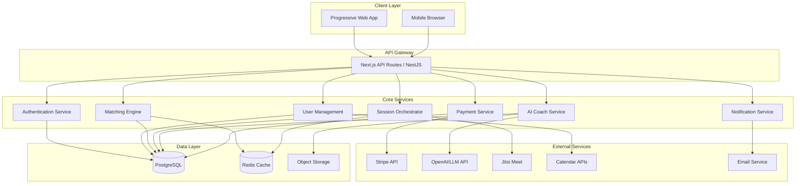

# Design Document

## Overview

The Learning Together Platform (Pactly) is designed as a modern web application that facilitates collaborative learning through small pods, structured sessions, and AI-powered coaching. The system architecture emphasizes real-time collaboration, scalable matching algorithms, and seamless integration with external tools while maintaining high availability and user safety.

The platform follows a microservices-inspired modular architecture with clear separation of concerns between user management, pod matching, session orchestration, AI coaching, and payment processing.

## Architecture

### High-Level Architecture



### Technology Stack

**Frontend:**
- React 18 with Next.js 14 (App Router)
- TypeScript for type safety
- Tailwind CSS for styling
- PWA capabilities with service workers
- WebRTC integration via Jitsi Meet SDK
- Real-time updates via WebSockets/Server-Sent Events

**Backend:**
- Node.js with NestJS framework or Python with FastAPI
- TypeScript/Python for type safety
- PostgreSQL for primary data storage
- Redis for caching and session management
- Background job processing (Bull Queue for Node.js, Celery for Python)

**Infrastructure:**
- Vercel/Render for frontend hosting
- Fly.io/Railway for backend services
- AWS RDS/Supabase for PostgreSQL
- AWS S3/Cloudflare R2 for file storage
- CloudFlare for CDN and DDoS protection

## Components and Interfaces

### 1. Authentication Service

**Responsibilities:**
- OAuth integration (Google, Microsoft, GitHub)
- JWT token management
- Session validation
- User registration and login

**Key Interfaces:**
```typescript
interface AuthService {
  authenticate(provider: OAuthProvider, code: string): Promise<AuthResult>
  validateToken(token: string): Promise<User | null>
  refreshToken(refreshToken: string): Promise<TokenPair>
  logout(userId: string): Promise<void>
}

interface AuthResult {
  user: User
  tokens: TokenPair
  isNewUser: boolean
}
```

### 2. User Management Service

**Responsibilities:**
- User profile management
- Preference storage
- Timezone and availability tracking
- Integration settings

**Key Interfaces:**
```typescript
interface UserService {
  createUser(userData: CreateUserDto): Promise<User>
  updateProfile(userId: string, updates: UpdateProfileDto): Promise<User>
  getUserPreferences(userId: string): Promise<UserPreferences>
  updatePreferences(userId: string, prefs: UserPreferences): Promise<void>
}

interface UserPreferences {
  timezone: string
  availabilityWindows: TimeWindow[]
  notificationSettings: NotificationPreferences
  collaborationStyle: CollaborationStyle
  integrations: IntegrationSettings
}
```

### 3. Matching Engine

**Responsibilities:**
- Pod formation algorithms
- Compatibility scoring
- Rematch handling
- Waitlist management

**Key Interfaces:**
```typescript
interface MatchingEngine {
  findMatches(userId: string, sprintType: SprintType): Promise<PodSuggestion[]>
  calculateCompatibility(users: User[]): Promise<CompatibilityScore>
  createPod(userIds: string[], sprintType: SprintType): Promise<Pod>
  requestRematch(userId: string, reason: RematchReason): Promise<RematchRequest>
}

interface CompatibilityScore {
  overall: number
  timezoneMatch: number
  experienceLevel: number
  collaborationStyle: number
  availabilityOverlap: number
}
```

### 4. Session Orchestrator

**Responsibilities:**
- Session scheduling and lifecycle management
- Video conferencing integration
- Attendance tracking
- Reminder notifications

**Key Interfaces:**
```typescript
interface SessionOrchestrator {
  createSession(podId: string, scheduledTime: Date): Promise<Session>
  startSession(sessionId: string): Promise<SessionDetails>
  endSession(sessionId: string, attendance: AttendanceRecord[]): Promise<void>
  scheduleReminders(sessionId: string): Promise<void>
  generateVideoLink(sessionId: string): Promise<string>
}

interface SessionDetails {
  id: string
  podId: string
  videoUrl: string
  agenda: AgendaItem[]
  participants: Participant[]
  startTime: Date
  status: SessionStatus
}
```

### 5. AI Coach Service

**Responsibilities:**
- Agenda generation
- Session note-taking
- Action item synthesis
- Quiz and assessment creation

**Key Interfaces:**
```typescript
interface AICoachService {
  generateAgenda(sessionContext: SessionContext): Promise<Agenda>
  takeNotes(sessionId: string, transcript: string): Promise<SessionNotes>
  synthesizeActions(notes: SessionNotes): Promise<ActionItem[]>
  createQuiz(topic: string, difficulty: string): Promise<Quiz>
  generateProofChecklist(actionItems: ActionItem[]): Promise<ProofChecklist>
}

interface SessionContext {
  sprintType: SprintType
  sessionNumber: number
  previousNotes: SessionNotes[]
  participantGoals: Goal[]
  timeAllocation: number
}
```

### 6. Payment Service

**Responsibilities:**
- Deposit processing
- Refund automation
- Credit ledger management
- Stripe integration

**Key Interfaces:**
```typescript
interface PaymentService {
  processDeposit(userId: string, amount: number): Promise<PaymentResult>
  calculateRefund(userId: string, sprintId: string): Promise<RefundCalculation>
  processRefund(userId: string, amount: number): Promise<RefundResult>
  getLedger(userId: string): Promise<TransactionHistory>
}

interface RefundCalculation {
  eligibleAmount: number
  sessionsCompleted: number
  sessionsRequired: number
  refundPercentage: number
}
```

## Data Models

### Core Entities

```typescript
// User Entity
interface User {
  id: string
  email: string
  name: string
  timezone: string
  createdAt: Date
  updatedAt: Date
  preferences: UserPreferences
  integrations: IntegrationSettings
}

// Pod Entity
interface Pod {
  id: string
  sprintType: SprintType
  locale: string
  createdAt: Date
  maxMembers: number
  currentMembers: number
  status: PodStatus
}

// Pod Membership
interface PodMembership {
  id: string
  userId: string
  podId: string
  role: MemberRole
  joinedAt: Date
  matchSignals: MatchingSignals
  status: MembershipStatus
}

// Session Entity
interface Session {
  id: string
  podId: string
  scheduledAt: Date
  startedAt?: Date
  endedAt?: Date
  videoUrl: string
  status: SessionStatus
  attendanceRequired: boolean
}

// Coach Document
interface CoachDoc {
  id: string
  sessionId: string
  version: number
  agenda: AgendaItem[]
  notes: SessionNotes
  actionItems: ActionItem[]
  quiz?: Quiz
  proofChecklist?: ProofChecklist
  createdAt: Date
}

// Check-in Entity
interface CheckIn {
  id: string
  userId: string
  sessionId: string
  submittedAt: Date
  attended: boolean
  rpe?: number
  win: string
  tweak: string
  proofOfEffort?: ProofSubmission
  status: CheckInStatus
}

// Goal Entity
interface Goal {
  id: string
  userId: string
  sprintType: SprintType
  title: string
  description: string
  schedule: Schedule
  proofMethod: ProofMethod
  startDate: Date
  endDate: Date
  status: GoalStatus
}
```

### Supporting Types

```typescript
enum SprintType {
  GYM_3X_WEEK = 'gym_3x_week',
  NET_PROMPTING = 'net_prompting'
}

enum SessionStatus {
  SCHEDULED = 'scheduled',
  ACTIVE = 'active',
  COMPLETED = 'completed',
  CANCELLED = 'cancelled'
}

enum PodStatus {
  FORMING = 'forming',
  ACTIVE = 'active',
  COMPLETED = 'completed',
  DISBANDED = 'disbanded'
}

interface Schedule {
  defaultSlots: TimeSlot[]
  backupSlot: TimeSlot
  timezone: string
  frequency: ScheduleFrequency
}

interface TimeSlot {
  dayOfWeek: number
  startTime: string
  duration: number
}
```

## Error Handling

### Error Classification

**Client Errors (4xx):**
- 400 Bad Request: Invalid input data, validation failures
- 401 Unauthorized: Missing or invalid authentication
- 403 Forbidden: Insufficient permissions
- 404 Not Found: Resource not found
- 409 Conflict: Resource state conflicts (e.g., already in pod)
- 429 Too Many Requests: Rate limiting

**Server Errors (5xx):**
- 500 Internal Server Error: Unexpected server errors
- 502 Bad Gateway: External service failures
- 503 Service Unavailable: Temporary service outages
- 504 Gateway Timeout: External service timeouts

### Error Response Format

```typescript
interface ErrorResponse {
  error: {
    code: string
    message: string
    details?: Record<string, any>
    timestamp: string
    requestId: string
  }
}
```

### Retry and Circuit Breaker Patterns

**External Service Integration:**
- Implement exponential backoff for transient failures
- Circuit breaker pattern for AI Coach and payment services
- Graceful degradation when non-critical services are unavailable

**Database Operations:**
- Connection pooling with automatic retry
- Read replica fallback for query operations
- Transaction rollback and retry for deadlock scenarios

## Testing Strategy

### Unit Testing
- **Coverage Target:** 80% code coverage for core business logic
- **Framework:** Jest for Node.js, pytest for Python
- **Focus Areas:**
  - Matching algorithm logic
  - AI Coach prompt generation
  - Payment calculation logic
  - Session state transitions

### Integration Testing
- **API Testing:** Automated tests for all REST endpoints
- **Database Testing:** Test data access layer with test database
- **External Service Mocking:** Mock Stripe, OpenAI, and calendar APIs
- **WebSocket Testing:** Real-time communication testing

### End-to-End Testing
- **Framework:** Playwright for browser automation
- **Critical User Journeys:**
  - Complete onboarding flow
  - Pod matching and acceptance
  - Session joining and completion
  - Check-in submission
  - Payment processing

### Performance Testing
- **Load Testing:** Simulate concurrent users during peak session times
- **Stress Testing:** Test system limits for matching algorithm
- **Database Performance:** Query optimization and indexing validation

### Security Testing
- **Authentication Testing:** OAuth flow security
- **Authorization Testing:** Role-based access control
- **Input Validation:** SQL injection and XSS prevention
- **Data Privacy:** GDPR compliance testing

## Performance Considerations

### Database Optimization
- **Indexing Strategy:**
  - Composite indexes on (userId, sprintType, status)
  - Timezone-based indexes for matching queries
  - Session scheduling indexes on (podId, scheduledAt)

- **Query Optimization:**
  - Pagination for large result sets
  - Eager loading for related entities
  - Read replicas for reporting queries

### Caching Strategy
- **Redis Caching:**
  - User session data (TTL: 24 hours)
  - Matching algorithm results (TTL: 1 hour)
  - AI Coach templates (TTL: 1 week)
  - Frequently accessed pod information

### Real-time Performance
- **WebSocket Optimization:**
  - Connection pooling and load balancing
  - Message queuing for offline users
  - Heartbeat monitoring for connection health

### CDN and Asset Optimization
- **Static Assets:** Serve via CloudFlare CDN
- **Image Optimization:** WebP format with fallbacks
- **Code Splitting:** Lazy load non-critical components
- **Bundle Optimization:** Tree shaking and minification

## Security and Privacy

### Authentication and Authorization
- **OAuth 2.0 + PKCE** for secure authentication
- **JWT tokens** with short expiration (15 minutes)
- **Refresh token rotation** for enhanced security
- **Role-based access control** (RBAC) for different user types

### Data Protection
- **Encryption at Rest:** AES-256 for sensitive data
- **Encryption in Transit:** TLS 1.3 for all communications
- **PII Handling:** Minimal data collection, pseudonymization where possible
- **Data Retention:** Automated deletion after user account closure

### Privacy Compliance
- **GDPR Compliance:**
  - Right to access personal data
  - Right to rectification
  - Right to erasure ("right to be forgotten")
  - Data portability
  - Consent management

### Content Safety
- **Moderation Tools:**
  - Automated content filtering for inappropriate language
  - User reporting system with admin review queue
  - Automatic suspension for repeated violations
  - Appeal process for disputed actions

## Monitoring and Observability

### Application Monitoring
- **APM Tool:** New Relic or DataDog for performance monitoring
- **Error Tracking:** Sentry for error aggregation and alerting
- **Uptime Monitoring:** Pingdom for service availability

### Business Metrics
- **User Engagement:**
  - Daily/Weekly/Monthly active users
  - Session completion rates
  - Check-in submission rates
  - Pod formation success rates

- **Platform Health:**
  - Matching algorithm performance
  - AI Coach response times
  - Payment processing success rates
  - Video call connection success rates

### Alerting Strategy
- **Critical Alerts:** Service downtime, payment failures, security breaches
- **Warning Alerts:** High error rates, slow response times, low match rates
- **Info Alerts:** Daily metrics summaries, weekly business reports